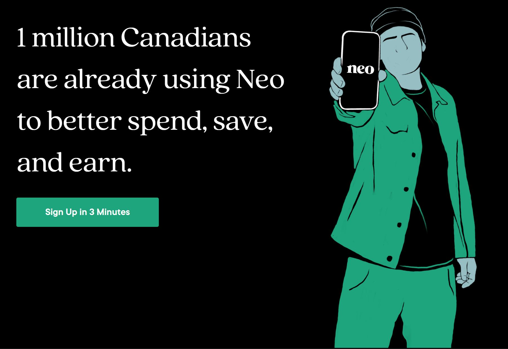
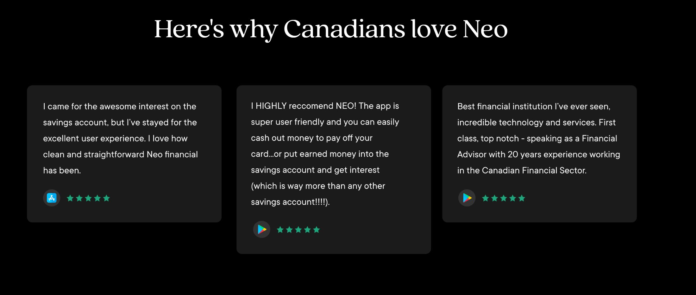
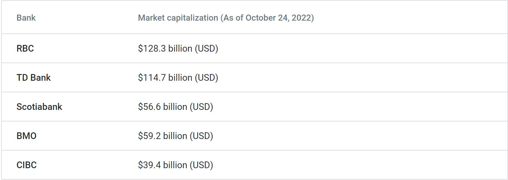

  
 

# Overview and Origin:

## ***What if the future of banking wasn’t a bank?*** 
### *Almost everything we do has been made better with technology, so why hasn’t the way we manage our money?*

Incorportaed in 2019, Neo Financial was built on the premise that Canadians have been underserved in their finances for far too long. After building SkipTheDishes into a top 10 brand in Canada, they are now set on challenging conventions with a smarter spending, saving and rewards experience for Canadians.

# **The Founders of NEO:**
The management team has a deep understanding of the 2-sided marketplace platform and scaling a B2C tech startup. 

# Funding
Neo Financial has raised a total of $235.8M in funding over 6 rounds. Their seed round of funding was held on March 1, 2019 and their latest funding was raised on May 5, 2022 from a Series C round. Neo Financial is funded by 18 investors. Valar Ventures and FJ Labs are the most recent investors. 

Neo has achieved unicorn status, or a valuation of over $1 billion. Also participating in the series C round were Tribe Capital, Altos Ventures, Blank Ventures, Gaingels, Maple VC and Knollwood Advisory.

# Business Activities
According to a very recent survey held by Manulife Bank, most Canadians (87%) believe we will soon enter a recession or are already in one, majority (56%) think that it will last at least a year, and nearly two-thirds (62%) say they don't feel prepared financially for a recession. Only 8% of Canadians state they're adjusting their financial plan, and only 5% are adjusting their debt re-payment plan. It would not be wrong to say that financial planning is a dire need for Canadians to help them manage their everyday finances appropriately.

Neo Financial is a technology company re-imagining spending, savings and rewards by using technology to simplify finances, create rewarding experiences and build community for all Canadians.
Neo has developed a very user friendly app to help their customers track their spending habits and gain valuable insights into their everyday purchases. 

With Neo Financial, the team has successfully launched a rewards-driven minimal viable product (MVP) with a credit card and a savings account to test the market. The team is focusing on user behaviour, capturing user feedback, and iteratively adding more related services. 

Neo Financial is challenging Canada’s big five banks by reimagining the customer experience of banking. Trusted by 1 million customers already in a short span of 3 years since incorporation, Neo's target customer is everyone who uses their smartphone for everyday banking purposes. 
It is imperative to understand that Neo is not a bank. It has partnered with Saskatoon-based Concentra Bank to offer savings accounts, and with ATB Financial, owned by the Alberta provincial government, for credit card issuance.

The top 5 banks in Canada control 93% of the market share but none of them offer the perks that Neo offers to its customers. They truly believe in providing Canadians with the best possible solutions so that they can help empower them financially. Neo offers a hybrid savings and chequing account that it hopes customers will treat as their primary account.The account pays 1.30% interest, which is 130 times higher than the rate paid by the big five banks. Not only that, the company also offers Canada's highest interest savings account with no annual fees, no minimum balance requirements, and 2.25% interest rate. 

The digital-only Neo Savings account offers many features of a current account, including unlimited free transactions and no monthly fees or minimum balance requirements. Offering a debit card with ATM access was not a priority for Neo in their initial phase because most Canadians use Credit cards for spending and pay it off using their bank accounts. 
Neo plans on offering loans, mortgages, and investment products to its customers in the near future. They also plan on introducing mobile cheque deposits shortly along with offering a debit card with ATM access.

# Landscape

Neo Financial is a company targetting mutliple domains of the financial industry. They provide solutions in the domains of Payments and Billing, Wealth Management, and Personal Finance currently and are planning on venturing into the Lending and Robo Advising domains as well. The tagline of the company, "***What if the future of banking wasn’t a bank?***" gives us an insight as to how the founders want to deliver a new baking solution to Canadian customers who have not experienced anything new in the market in the past 24 years, when ING Bank of Canada stepped into the market (acquired by Scotiabank in 2012, now known as "***Tangerine***")

Neo's USP is providing the Canadian customers with a better financial product, offering a higher APY interest than all the maor 5 banks who control the lion's share of the market currently. The super fast growth of the company, transitioning it into a Unicorn, is only confirmation of the fact that Canadians need a modern banking solution company like Neo. Neo's main competitors are Canada's top 5 Banks:

1. Royal Bank of Canada (RBC)
2. Bank of Montreal (BMO)
3. Bank of Nova Scotia (BNS/ Scotiabank)
4. Toronto Dominion Bank (TD)
5. Canadian Imperial Bank of Commerce (CIBC) 

# Results

I believe that Neo is on the right track, seeing the growth spurt of the company. Neo is on the path of providing Canadian condumers with a better financial tool to help manage their perosnal finances by giving them a higher interest rates on their chequings and savings accounts and providing them with an app to help track their daily spending habits and improve. Neo has been able to acquire a customer base of over 1 million users and 7000 businesses over the short time period of only 3 years since its incorpration in 2019 which I feel is quite commendable. 

Dont believe me! Read the customer reviews below:

Neo, with a valuation of $1 Billion, still has a long way to go in comparison to its competitors who have been in the market for a very long time! Neo Financial was incorporated in 2019 whereas its competitors were established in the 1800's. BMO (Founded in 1817) is Canada's oldest bank, followed by Scotiabank (established in 1832), TD (establsihed in 1855), CIBC (established in 1867), and lastly RBC (establsihed in 1869). Even though RBC was the last to establish its roots in the Canadian Market, it controls the largest market share and has the highest Market Cap.

The growth of the company has been very fast and I have high hopes that Neo will outperform its competitors in the long run just on the basis of the fact that they provide a better financial tool than any of its competitors in the market. I believe that there is no valid reason for a rational and informed Canadian consumer to not take advantage of the perks being offered by Neo Financial. 

# Recommendations

The only major recommendation I have for Neo is to partner up with a service/institution that allows them to facilitate ATM access for its customers. Customers are unable to deposit and withdraw cash using their Neo cards and accounts at the moment which equates to them needing 2 seperate financial institutions in order to be able to manage their finances. 

Neo needs to work towards becoming THE CHOICE for Canadian customers by h